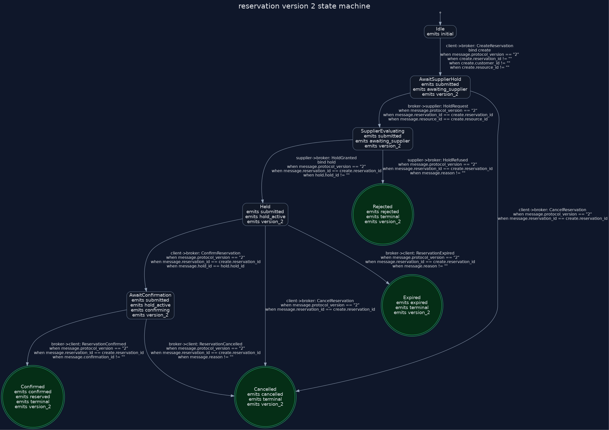
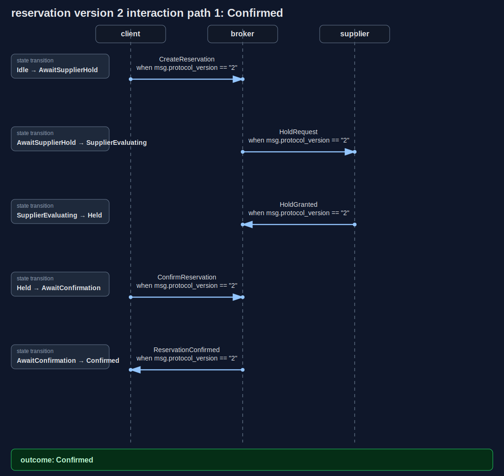

# Proto Conversation Spec

This repo sketches a specification system built around a strict boundary:

- `.proto` files define atomic serialized messages.
- `.convspec` files define valid conversations built from those messages.
- the compiled observable protocol becomes a state machine / Kripke structure for temporal checking

The key idea is that protobuf should not try to encode protocol flow. A conversation spec imports message types from protobuf, then defines:

- participants
- states
- allowed message directions
- guards over message fields
- correlation rules between messages
- terminal and error paths
- observable propositions for model checking

This makes the project closer to a conversation-focused OpenAPI/Swagger layer than a replacement for protobuf. Protobuf remains the message schema substrate; `.convspec` adds transport-facing behavior, scenarios, temporal claims, quantitative assumptions, and generated documentation views.

The larger target is a [literate spec workbench](docs/literate-spec-workbench.md): a browser chat where executable specs, diagrams, proofs, metrics, and design prose live together. The LLM helps argue and revise the spec, while deterministic Go tooling remains the source of truth for diagrams, checks, and measurements.

## Project Tooling Spec

The project now maintains a self-spec for the toolchain itself:

- Source: [examples/project_tooling.convspec](examples/project_tooling.convspec) and [examples/project_tooling.proto](examples/project_tooling.proto)
- GitHub-rendered diagrams: [docs/diagrams/project_tooling.md](docs/diagrams/project_tooling.md)
- Purpose: describes the browser/editor, Go web server, deterministic compiler, Graphviz renderer, OpenAI request, evidence side panel, and local fallback loop.

This is the contract for the workbench: edited specs are compiled first, deterministic evidence is rendered by Go/Graphviz, and the LLM responds against that evidence rather than becoming the source of truth for diagrams, checks, or metrics.

See [docs/conversation-spec.md](docs/conversation-spec.md) for the language and model, [examples/auth.proto](examples/auth.proto) with [examples/auth.convspec](examples/auth.convspec) for a minimal example, and [examples/reservation.proto](examples/reservation.proto) with [examples/reservation.convspec](examples/reservation.convspec) for a versioned reservation protocol that is intended to compile into a CTL-checkable state machine.

The [byte-accounting example](examples/byte_accounting.convspec) with [its protobuf messages](examples/byte_accounting.proto) models a probabilistic user, client, server, auth service, and database. Every transition has an explicit byte count, so `--format metrics` can enumerate terminal scenarios and report the exact bytes sent over each actor pair in each scenario.

The [bakery-day stress test](examples/bakery_day.convspec) with [its protobuf messages](examples/bakery_day.proto) models a bread bakery day with bakers, inventory, oven carousel, cooling racks, wrapping, trucks, storefront sales, Stripe/cash closeout, charity pickup, waste, payroll, and manager warnings. It includes product-mix fields and sales/load observations that would feed pie charts and money/queue line charts as the metrics renderer grows. Its GitHub-rendered diagrams are in [docs/diagrams/bakery_day.md](docs/diagrams/bakery_day.md).

See [docs/evidence-workbench.md](docs/evidence-workbench.md) for the intended direction: a web-based design workbench where chat responses can include deterministic diagrams, temporal-check results, counterexample traces, and metrics views.

## Reservation Example

The reservation example shows the current target shape: protobuf messages define the payloads, while the conversation spec defines the observable protocol, CTL assertions, probabilities, latency/traffic assumptions, and queueing assumptions.

- Source: [examples/reservation.proto](examples/reservation.proto) and [examples/reservation.convspec](examples/reservation.convspec)
- GitHub-rendered diagrams: [docs/diagrams/reservation.md](docs/diagrams/reservation.md)
- Local HTML report: [docs/diagrams/reservation.html](docs/diagrams/reservation.html)
- Direct diagram links: [state machine](docs/diagrams/reservation_assets/reservation_v2_state.png), [confirmed interaction](docs/diagrams/reservation_assets/reservation_v2_path_01.svg), [cancelled interaction](docs/diagrams/reservation_assets/reservation_v2_path_02.svg), [expired interaction](docs/diagrams/reservation_assets/reservation_v2_path_04.svg), [rejected interaction](docs/diagrams/reservation_assets/reservation_v2_path_05.svg)

The committed diagrams below are generated by the Go compiler so they can be viewed from GitHub without rebuilding local `build/` output.





The same spec also includes human-readable CTL aliases:

```text
assert eventually_terminal: always(submitted -> mustEventually(confirmed or cancelled or rejected or expired))
assert no_double_outcome: always(!(confirmed and cancelled))
assert confirmation_possible: possibly(confirmed)
assert hold_settles: always(hold_active -> mustEventually(confirmed or rejected or expired or cancelled))
```

And quantitative assumptions for deterministic charts and queueing estimates:

```text
on broker -> supplier HoldRequest
  chance 0.82
  latency_ms 28
  bytes 420
  queue supplier_hold_requests
  goto SupplierEvaluating

queue supplier_hold_requests {
  arrival_rate 180/s
  service_time_ms 22
  workers 6
  capacity 500
}
```

## Go Compiler

The repository includes a dependency-free Go compiler that reads a `.convspec` file, indexes its imported `.proto` messages, validates references, and emits diagrams or JSON.

```bash
go run ./cmd/convspec examples/auth.convspec
go run ./cmd/convspec examples/reservation.convspec --format html -o build/reservation.html
go run ./cmd/convspec examples/reservation.convspec --format dot
go run ./cmd/convspec examples/reservation.convspec --format mermaid-sequence
go run ./cmd/convspec examples/reservation.convspec --format checks
go run ./cmd/convspec examples/reservation.convspec --format metrics
go run ./cmd/convspec examples/reservation.convspec --format json -o build/reservation.json
```

Formats:

- `html`: browser page with a Graphviz-rendered PNG state machine and Go-rendered SVG interaction diagrams for each scenario.
- `mermaid`: one state diagram per conversation, showing every legal branch.
- `mermaid-sequence`: one sequence diagram per acyclic terminal path.
- `dot`: Graphviz DOT state graph.
- `checks`: CTL assertion results.
- `metrics`: estimated scenario, outcome, and queue metrics.
- `json`: compiler model for later tooling.

Open the generated HTML file directly in a browser:

```bash
go run ./cmd/convspec examples/reservation.convspec --format html -o build/reservation.html
```

The HTML generator invokes `dot -Tpng` for the global state-machine reference view and for actor-local protocol projections. It renders each terminal scenario as a deterministic SVG interaction diagram showing participant lifelines, messages, guards, bindings, and the state transition taken by each message. Assets are written next to the report and linked from the page. The interaction diagrams are the main implementation surface; actor projections show the send/receive callback surface for each participant.

Assertions live inside a conversation:

```text
assert eventually_terminal: always(submitted -> mustEventually(confirmed or cancelled or rejected or expired))
assert no_double_outcome: always(!(confirmed and cancelled))
assert confirmation_possible: possibly(confirmed)
```

Current CTL support includes readable aliases `possibly`/`risks` (`EF`), `mustEventually`/`must_eventually`/`eventually` (`AF`), `always` (`AG`), `possibly_always` (`EG`), and `canPermanently`/`can_permanently`/`can_stabilize`/`can_become_stable` (`EF(EG ...)`). Boolean expressions support infix `and`, `or`, implication `->`, prefix `and(...)`, `or(...)`, `implies(...)`, Lisp-style `(and not(well) dead)`, `not`/`!`, and parentheses over observable state propositions. The older `becomes` alias for `AF` still works for compatibility, but examples avoid it because it can sound permanent.

Check output includes a mechanical English rendering using `A = must`, `E = may`, `F = happen`, and `G = become`:

```text
EF(not(well) -> EU(well, virus))
english: may happen not well implies may well until virus

AG(alive -> AU(alive, dead))
english: must become alive implies must alive until dead
```

Strong until is also supported:

```text
alive Until dead
always(!(alive and dead))
```

`Until`/`until` is universal (`AU`): every path must eventually reach the right-hand condition, and the left-hand condition must hold before then. `canUntil`/`can_until` is existential (`EU`): at least one path can keep the left-hand condition true until the right-hand condition is reached. This is appropriate for semi-permanent propositions such as `alive`, `hold_active`, or `authenticated`. A weaker "alive unless dead, but death may never happen" operator is not implemented yet.

Interaction diagrams omit scalar default-value guard noise such as `field != ""`, `field == ""`, `field == 0`, and `field == false`. Those guards remain in the compiled model; they are hidden only from scenario diagrams.

Quantitative annotations are optional and assumption-based:

```text
on broker -> supplier HoldRequest
  chance 0.82
  latency_ms 28
  bytes 420
  queue supplier_hold_requests
  goto SupplierEvaluating

queue supplier_hold_requests {
  arrival_rate 180/s
  service_time_ms 22
  workers 6
  capacity 500
}
```

These annotations feed deterministic metrics, outcome charts, traffic/latency charts, and M/M/c queue estimates. They do not affect CTL truth. Queue arrival rates and service times are static assumptions today; the intended next layer is to derive them from stochastic actors and observable traffic/load messages, then render product mix, money flow, and queue depth as deterministic charts.

Current compiler scope:

- Supports the DSL used in `examples/*.convspec`.
- Validates participants, message type names, start states, and transition targets.
- Parses enough proto syntax to discover top-level message names and fields.
- Does not yet use `protoc` descriptors or evaluate guard expressions semantically.

The compiler library lives under `internal/convspec`, with the command-line wrapper in `cmd/convspec`. That split is deliberate: the next tool can be a Go web server that imports the compiler, serves the rendered diagrams at a URL, and lets a user discuss proposed spec changes with an LLM against the same compiled model.

Run tests with:

```bash
go test ./...
```
