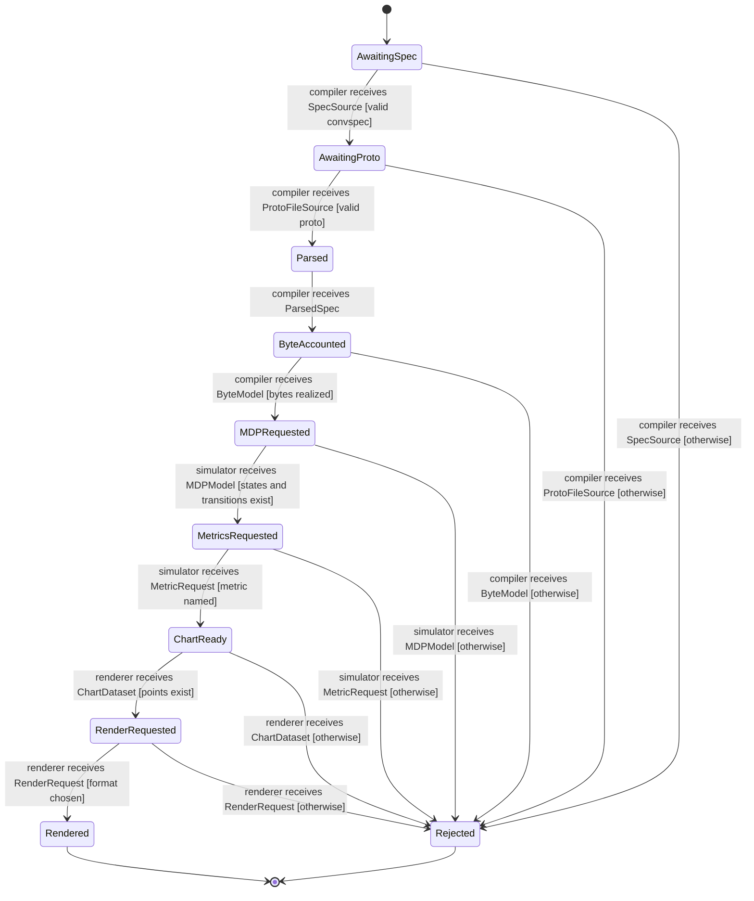
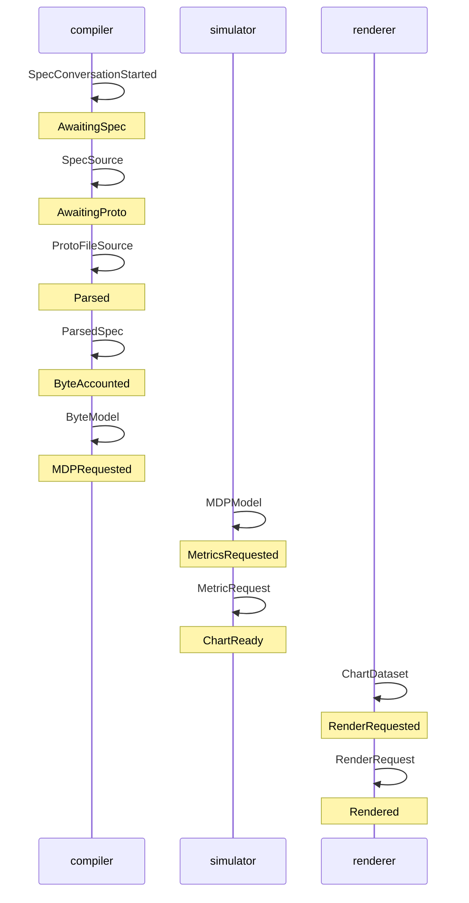

# Proto Conversation Spec

This repo sketches a Go compiler for actor-local protocol specifications.

- `.proto` files define serialized messages.
- `.convspec` files define observable actor behavior in Lisp syntax.
- the compiled model renders state machines, interaction scenarios, metrics, and CTL checks.

The current language is intentionally actor-local. A state belongs to an `(actor ...)` block, and `(on Message ...)` means that actor received `Message` from its single spec-wide bounded FIFO inbox. Message origin is not part of the handler syntax; if a return address or source identity matters, put it in the protobuf message.

Each conversation starts when an actor consumes a protobuf activation message from that inbox. Actor state machines are then defined from scratch for that conversation; actor-wide resources stay at spec scope.

The project now includes a self-model at [examples/spec_model.convspec](examples/spec_model.convspec) with protobuf messages in [examples/spec_model.proto](examples/spec_model.proto). It is the Swagger-like target for this tool: completely realized message serialization, actor capacity for queueing metrics, probabilities for MDP-style metrics, declared line/pie chart views, and CTL assertions over observable states. See [docs/spec-model.md](docs/spec-model.md).

## Spec Model Walkthrough

The self-model is the best current example:

- [examples/spec_model.convspec](examples/spec_model.convspec) is the root spec.
- [examples/spec_model.proto](examples/spec_model.proto) defines the serialized messages.
- [examples/spec_model_compile_measure_render.convspec](examples/spec_model_compile_measure_render.convspec) defines one conversation.

The root spec declares actor instances and their inbox capacities:

```text
(spec spec_model
  (import "spec_model.proto")

  (actor author (role spec_author) (capacity 16))
  (actor compiler (role convspec_compiler) (capacity 64))
  (actor simulator (role mdp_simulator) (capacity 32))
  (actor renderer (role evidence_renderer) (capacity 32))

  (include "spec_model_compile_measure_render.convspec"))
```

The conversation starts when `compiler` consumes a `SpecConversationStarted` message. From there, the conversation walks through protobuf-backed messages for source input, byte accounting, MDP construction, metric requests, chart data, and rendering.

```text
(conversation compile_measure_render
  (start compiler SpecConversationStarted AwaitingSpec)
  ...)
```

GitHub renders Mermaid diagrams directly in this README, so the state-machine view is visible without opening generated HTML:



The same conversation also renders as interaction scenarios. The successful path currently looks like:



Generate the full dark-mode HTML report locally:

```bash
mkdir -p build
go run ./cmd/convspec examples/spec_model.convspec --format html -o build/spec_model.html
```

That page includes the deterministic Graphviz state machines, actor projections, all interaction paths, CTL checks, and metric summaries.

The current checks show one evaluated conversation assertion and one parsed-but-not-yet-evaluated spec-level assertion:

```text
ERROR spec.all_conversations_eventually_resolve: always(mustEventually(terminal))
  error: spec-level CTL assertions are parsed but not evaluated yet
PASS compile_measure_render.eventually_rendered_or_rejected: always(mustEventually(Rendered or Rejected))
```

The metrics output enumerates all terminal paths. Today the happy path is estimated at probability `0.8670`, dwell time `125ms`, `514` nominal protobuf bytes, and availability `0.985025` from the declared actor reliability assumptions.

## Smaller Example

```text
(spec auth
  (import "auth.proto")
  (actor server (capacity 64))

  (include "auth_login.convspec")
)
```

`examples/auth_login.convspec`:

```text
(conversation login
  (start server LoginConversationStarted Idle)
  ...)
```

## Go Compiler

```bash
go run ./cmd/convspec examples/auth.convspec
go run ./cmd/convspec examples/auth.convspec --format html -o build/auth.html
go run ./cmd/convspec examples/auth.convspec --format dot
go run ./cmd/convspec examples/auth.convspec --format mermaid-sequence
go run ./cmd/convspec examples/auth.convspec --format checks
go run ./cmd/convspec examples/auth.convspec --format metrics
go run ./cmd/convspec examples/auth.convspec --format json -o build/auth.json
go run ./cmd/convspec examples/spec_model.convspec --format html -o build/spec_model.html
```

Formats:

- `html`: browser page with Graphviz state machine and SVG interaction scenarios.
- `mermaid`: one state diagram per conversation.
- `mermaid-sequence`: one sequence diagram per acyclic terminal path.
- `dot`: Graphviz DOT state graph.
- `checks`: CTL assertion results.
- `metrics`: estimated outcome, dwell-time, byte, inbox, and reliability metrics.
- `json`: compiler model for later tooling.

Run the chat workbench locally:

```bash
go run ./cmd/specweb
```

Run tests:

```bash
go test ./...
```

See [docs/conversation-spec.md](docs/conversation-spec.md) for the language model and [docs/evidence-workbench.md](docs/evidence-workbench.md) for the workbench direction.
