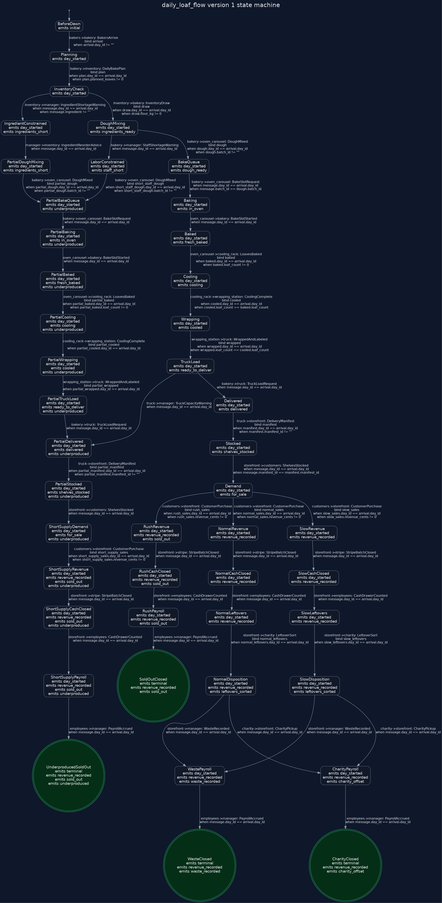
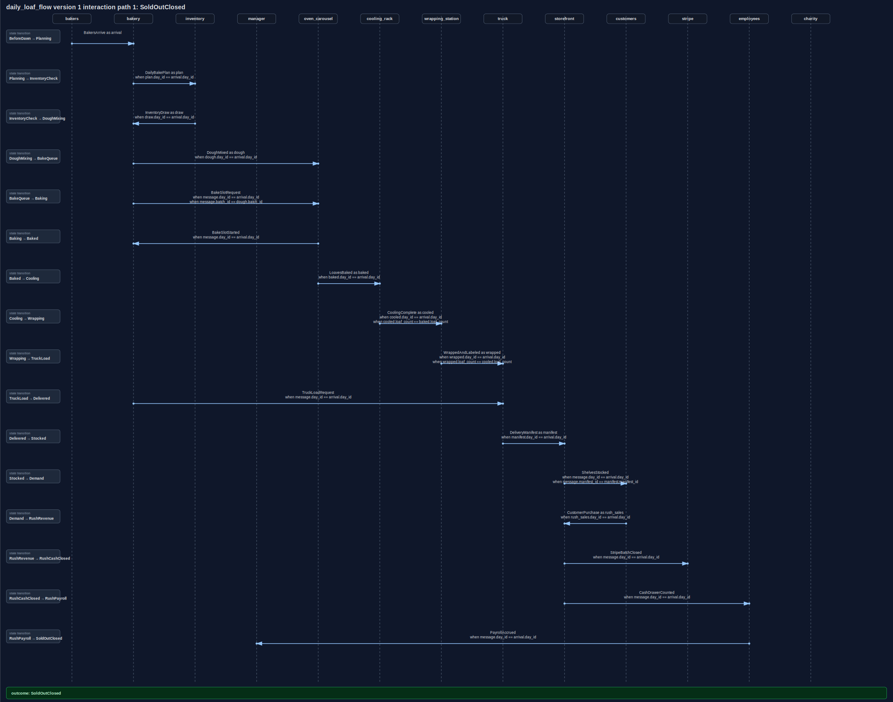
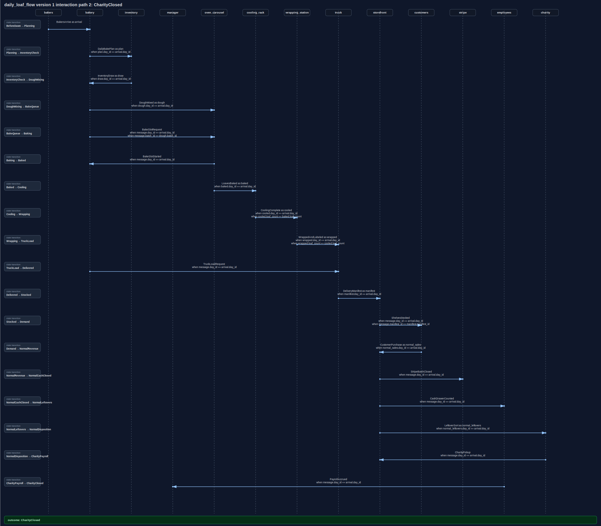
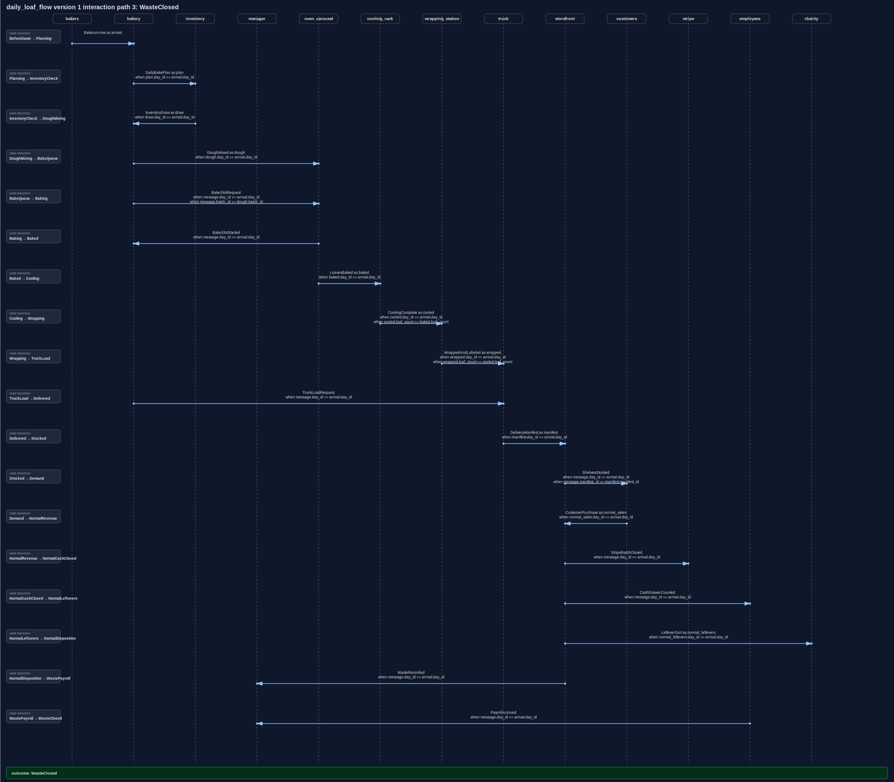
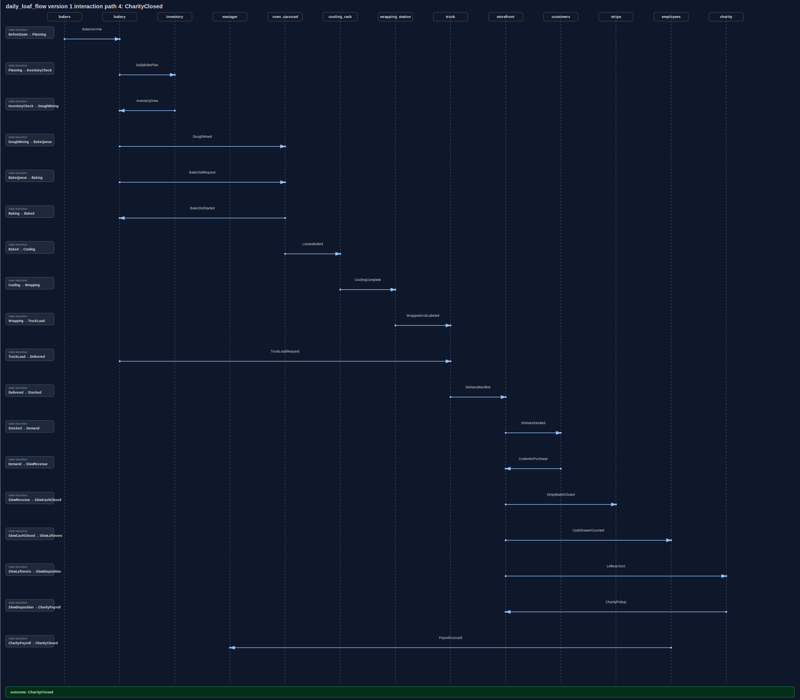
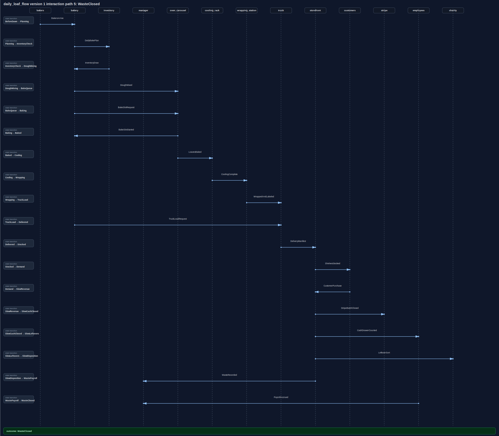
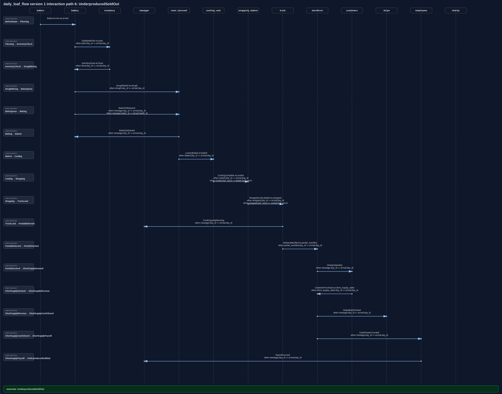
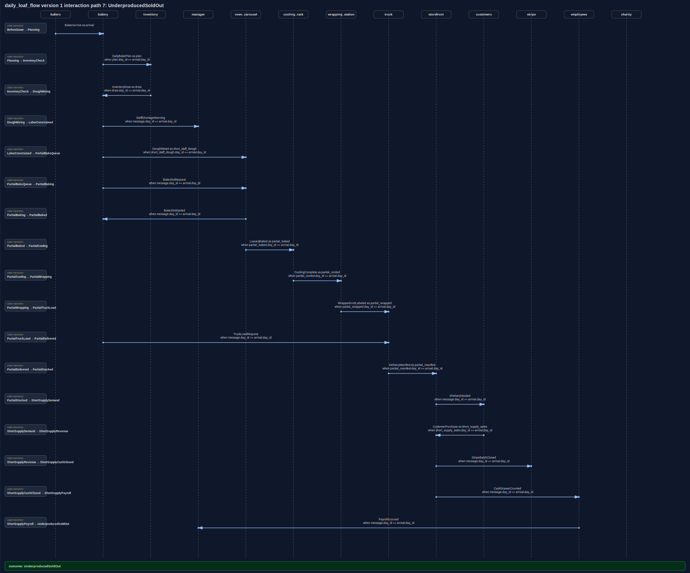
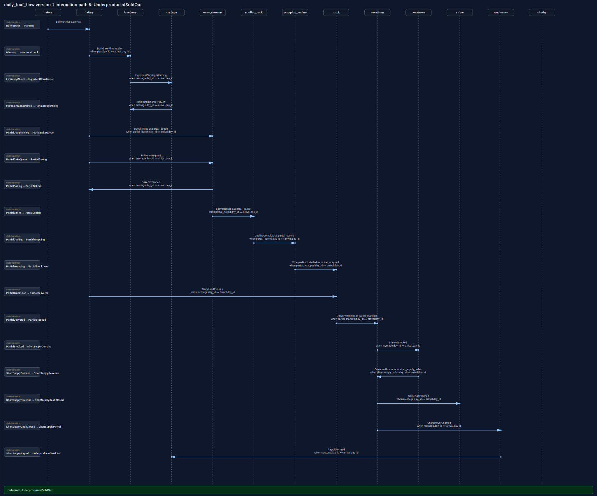

# Bakery Day Diagrams

Generated from [examples/bakery_day.convspec](../../examples/bakery_day.convspec) and [examples/bakery_day.proto](../../examples/bakery_day.proto).

This stress-test example models a bread bakery day: early bakers, inventory draw, dough mixing, oven carousel turns, cooling, wrapping, truck delivery, storefront sales, Stripe/cash closeout, leftover sorting, charity pickup, waste, and payroll accrual.

The protobuf messages include product-mix and traffic-log fields so later deterministic renderers can draw charts for challah/sourdough/cinnamon mix, loaves sold/donated/wasted, money flow through card/cash sales, payroll, waste loss, charity rebate estimates, and queue load observations.

The deterministic HTML report is also checked in at [bakery_day.html](bakery_day.html), but GitHub's repository viewer shows HTML files as source. This Markdown page is the GitHub-rendered view.

## State Machine

## Interaction Scenarios

### Path 1: Sold Out

### Path 2: Normal Sales With Charity Pickup

### Path 3: Normal Sales With Waste

### Path 4: Slow Sales With Charity Pickup

### Path 5: Slow Sales With Waste

### Path 6: Truck Capacity Shortage

### Path 7: Staff Shortage

### Path 8: Ingredient Shortage

