# Project Tooling Diagrams

Generated from [examples/project_tooling.convspec](../../examples/project_tooling.convspec) and [examples/project_tooling.proto](../../examples/project_tooling.proto).

The deterministic HTML report is also checked in at [project_tooling.html](project_tooling.html), but GitHub's repository viewer shows HTML files as source. This Markdown page is the GitHub-rendered view.

## State Machine

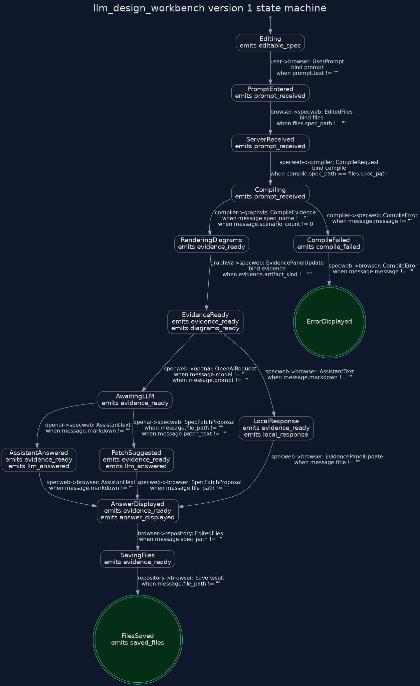

## Actor Protocol Projections

These projections show the send/receive callback surface for each actor in the workbench.

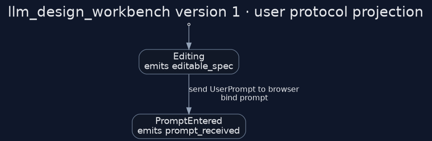

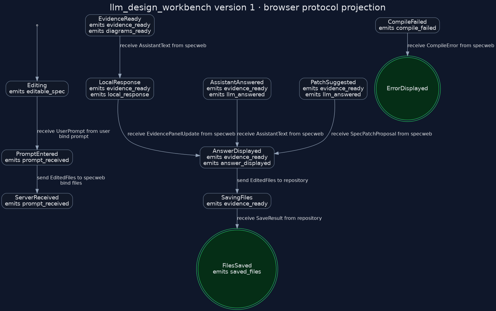

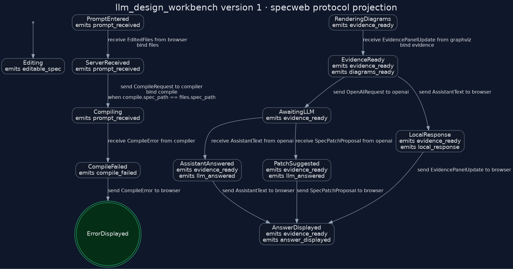

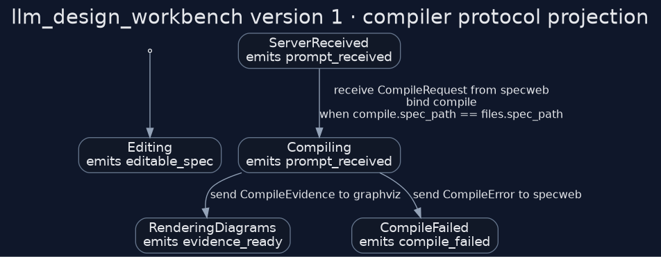

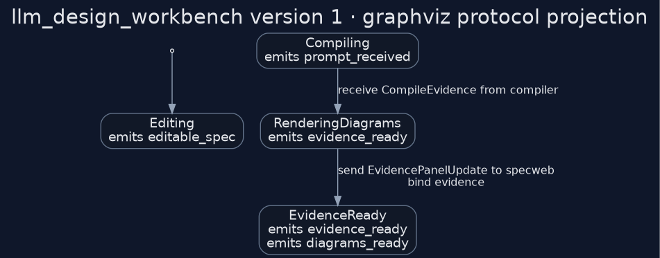

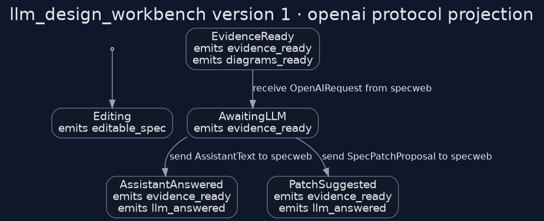

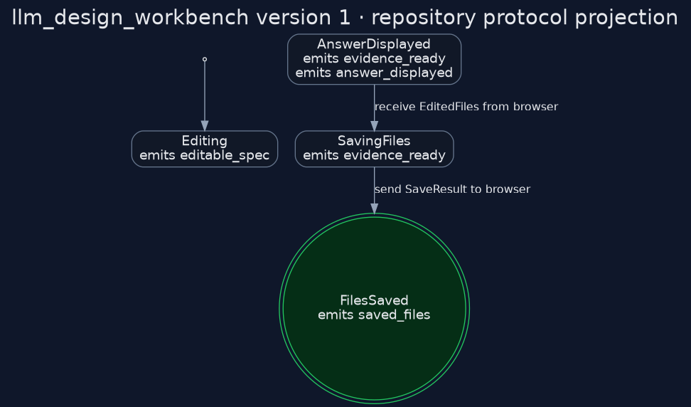

## Interaction Scenarios

### Path 1: LLM Text Answer Saved

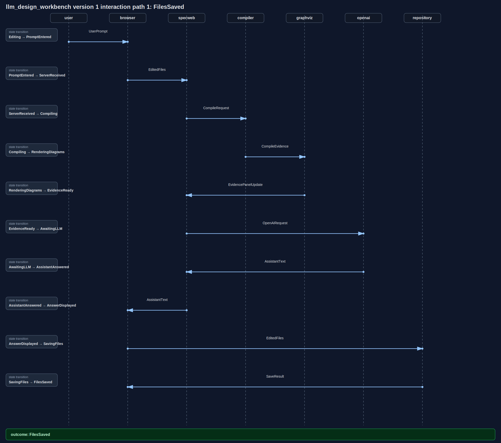

### Path 2: LLM Patch Proposal Saved

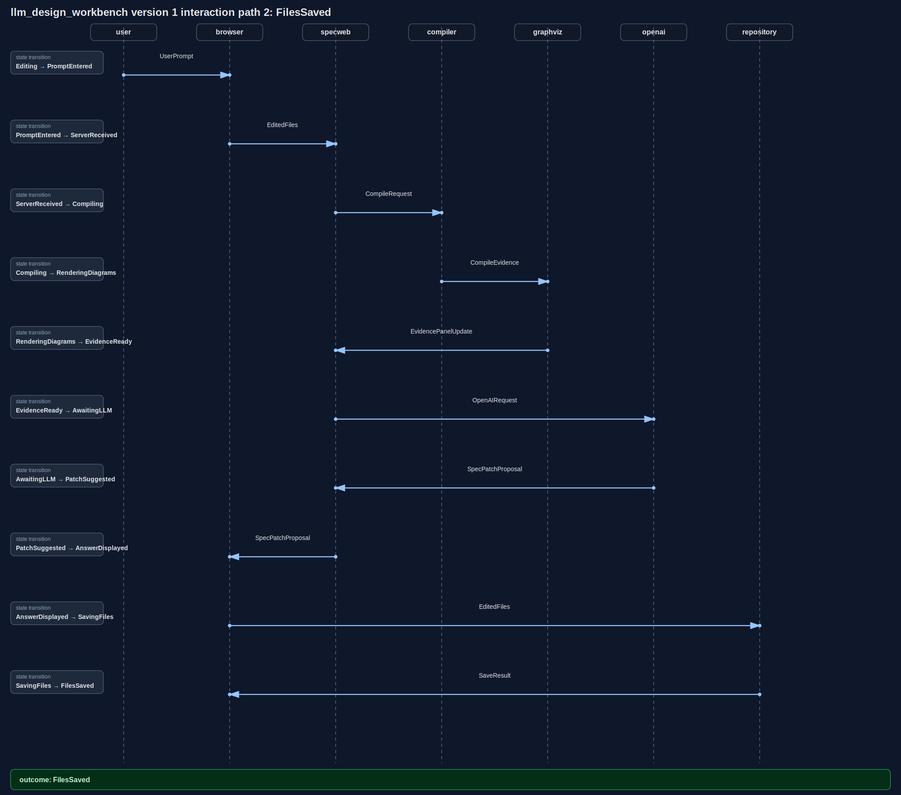

### Path 3: Local Compiler Fallback Saved

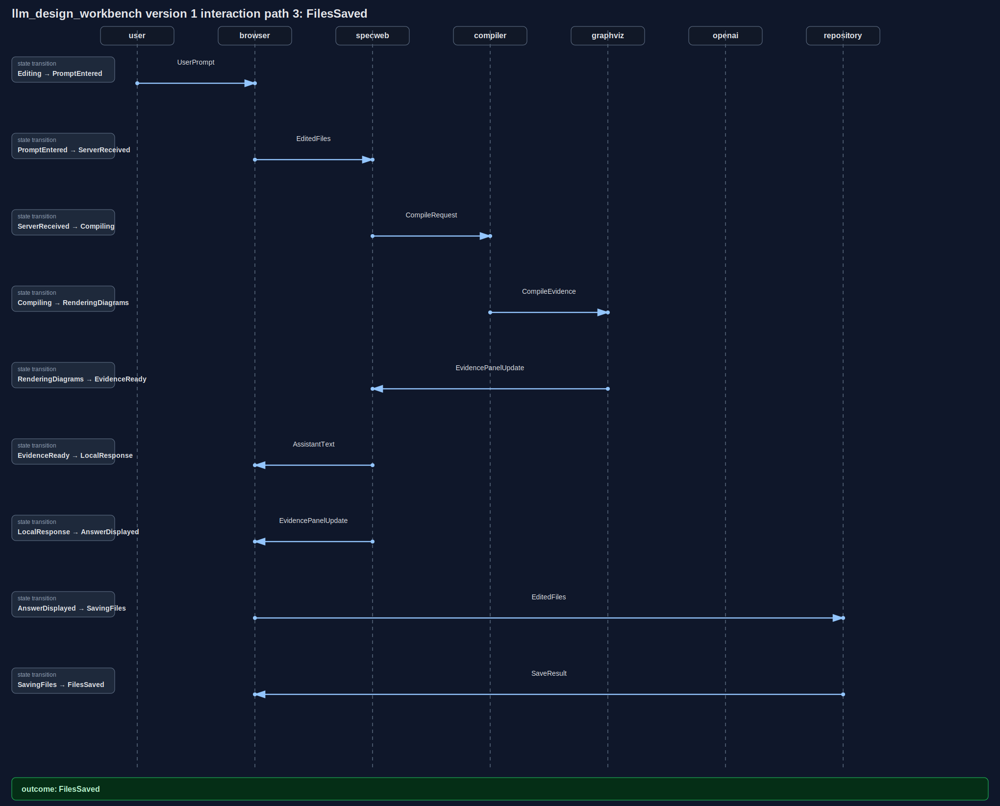

### Path 4: Compile Error

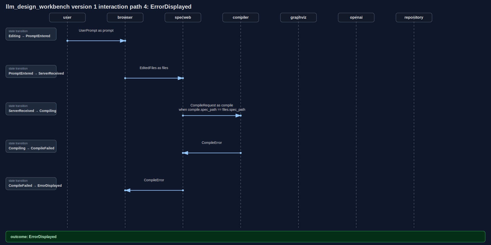
