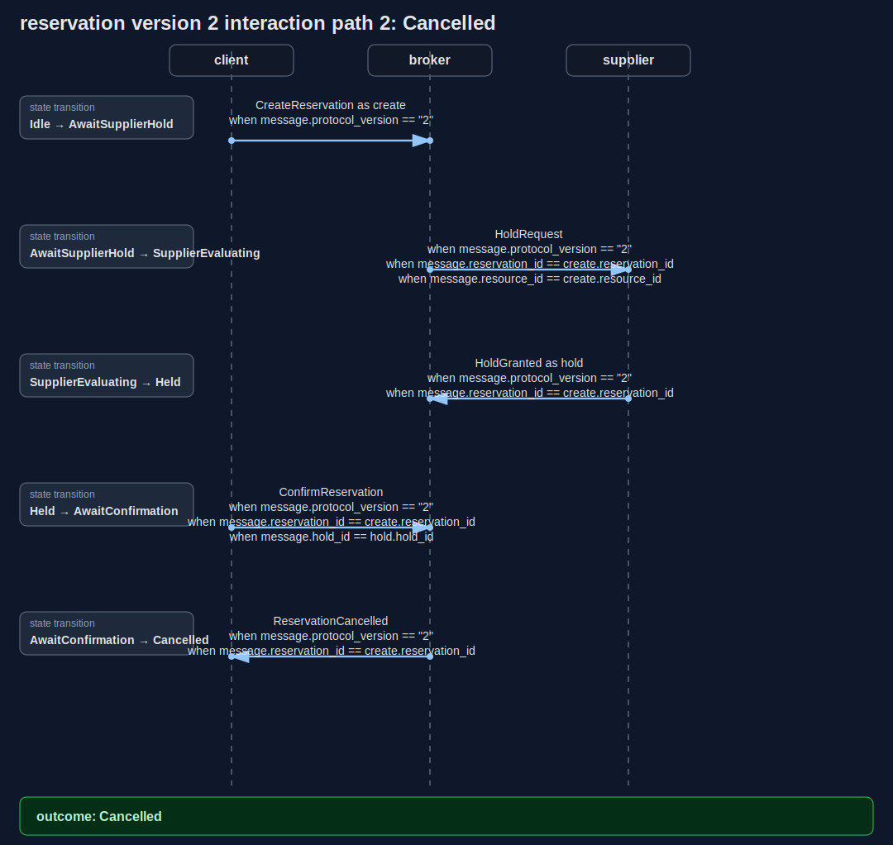
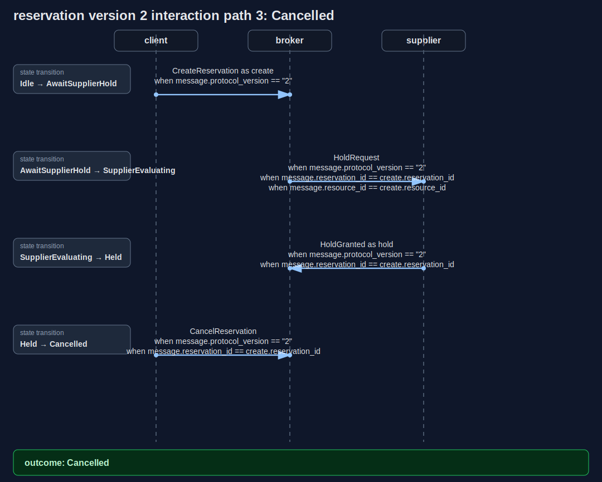
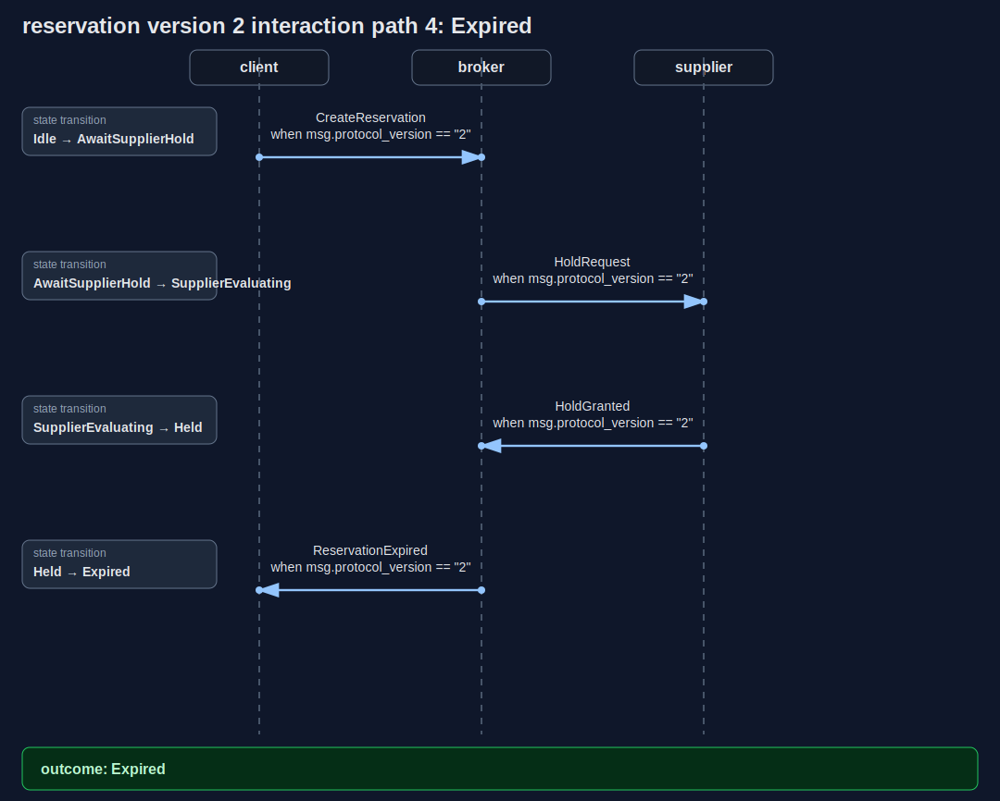
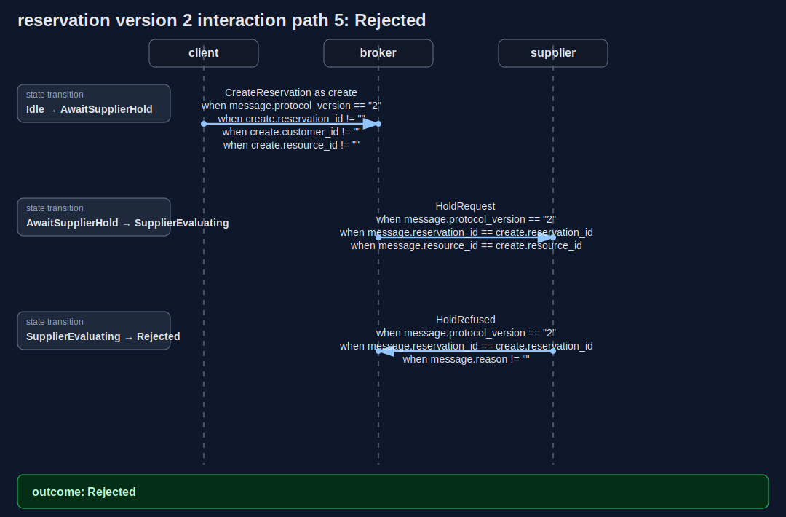
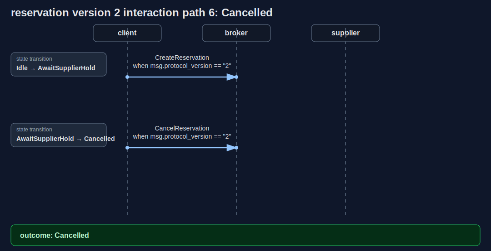

# Reservation Protocol Diagrams

Generated from [examples/reservation.convspec](../../examples/reservation.convspec) and [examples/reservation.proto](../../examples/reservation.proto).

The deterministic HTML report is also checked in at [reservation.html](reservation.html), but GitHub's repository viewer shows HTML files as source. This Markdown page is the GitHub-rendered view to link from issues, pull requests, and project notes.

## State Machine

## Interaction Scenarios

### Path 1: Confirmed

### Path 2: Cancelled

### Path 3: Cancelled

### Path 4: Expired

### Path 5: Rejected

### Path 6: Cancelled

